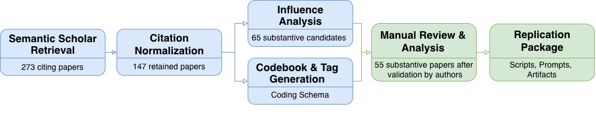

| Step | Action | #Papers | Artifacts |
|---|---|--|---|
| 1 | Semantic Scholar retrieval  | 273 | [scripts](scripts/01_retrieval/) |
| 2 | Citation normalization      | 147 | [scripts](scripts/02_normalization/) |
| 3 | Influence analysis          |65   |  [files](analysis/influence_levels/) |
| 4 | Codebook and tag generation |     | [files](analysis/codebook/) |
| 5 | Manual review  - Final Paper set:       | __55__  | [files](analysis/manual_review/) |
| 6 | Replication package | | [scripts](scripts/), [prompts](prompts/), [artifacts](artifacts/) |
